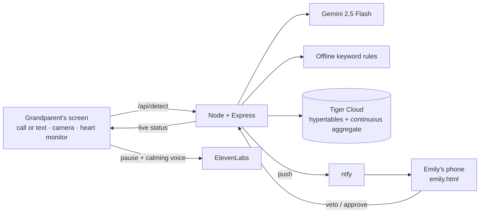

# Swivel Sentio

**A quiet shield against phone and text scams that target older adults.**

When a scammer pressures a grandparent to pay, Swivel Sentio **pauses the payment**, **calms them with a
gentle AI voice**, and **buzzes their daughter's real phone** so she can veto it with one tap.
Grandparent's screen updates the moment she decides.

> **Ask one question before money moves: _is this really you?_** · Demo domain: `isthisreallyyou.biz`
>
> RowdyHacks XII · **Swivel** (Social Engineering Shield) · **Best Use of Gemini API** ·
> **Best Use of ElevenLabs** · **Best Use of Tiger Data** · **Best Design** · **CyberJedis** ·
> **Best Domain (GoDaddy Registry)**

---

## The problem

Older adults lose billions a year to fake IRS calls, "grandchild in jail" calls, tech-support
scams, and phishing texts. These scams all work the same way: **fear plus urgency plus secrecy**,
so the victim pays before anyone they trust can say "wait." Banks catch fraud *after* the money
moves. Swivel Sentio adds friction *before* it moves, at the moment of pressure.

## What it does

1. **Listens to the call or reads the text.** Google Gemini judges how likely it is to be a scam
   and explains why in plain words. Offline keyword rules back it up if the network is down.
2. **Notices how the grandparent is reacting.** An optional on-device camera check-in reads their
   expression (Calm, Uneasy, Worried, Scared). An optional heart monitor reads their pulse. A scared
   face or a racing heart raises the risk.
3. **Pauses the payment.** Grandparent's screen gently takes over: *"Take a deep breath. We've
   paused this payment."* An ElevenLabs voice talks them down without repeating the scammer's
   threats.
4. **Asks family.** Emily's real phone gets a push notification and a live page showing the
   amount, the scam type, Gemini's explanation, and how the grandparent looks. **Veto** is one tap.
   **Approve** takes two deliberate taps and never works from the lock screen.
5. **Remembers everything.** Every checked payment (safe or not), every stress reading and every
   family decision goes into Tiger Data, so the history survives restarts.

## Built for each track

### Swivel: the Social Engineering Shield
Everything in the brief: AI that **flags suspicious payment requests** (calls *and* texts),
**friction that forces a second thought** (the pause screen and calming voice), and a
**trusted-contact approval flow** (Emily's phone).
- **"Family check on every money request"** setting. Even a normal-sounding text that seems to
  be from family waits for Emily, because numbers can be spoofed.
- **Asymmetric controls.** Stopping money is one tap; releasing money takes a confirmed second tap
  inside the app.
- Protection rules: wire-transfer lock, gift-card lock, an unverified-payment limit.

### Google Gemini API: `lib/gemini.js`
- `gemini-2.5-flash` with **structured JSON output** returns a 0–100 scam score, a scam type
  ("Grandparent scam", "Delivery fee phishing"…), the exact pressure phrases it found, and a
  **calm, plain-language explanation** written for an older adult.
- Handles **calls and text messages** differently (`channel`).
- Fused with offline keyword rules: the stronger signal wins, so the shield never depends on
  the network.
- Cost-safe: responses cached by message, capped per run, never retried, and switched off after
  any quota or auth refusal.

### ElevenLabs: `lib/voice.js`
- When a scam is caught, a warm voice ("Sarah") speaks a script **written for someone already
  frightened**: reassurance first, short sentences, and **never repeating the scammer's threats**
  (the test suite checks that the government-impostor script never says "IRS", "arrest" or
  "police").
- Separate scripts for government impostors, grandparent scams, gift-card scams, and texts.
- Each script is synthesized once and **cached**, so replays cost nothing. The browser's best
  natural voice is the fallback.

### Tiger Data: `lib/tigerdata.js` (Tiger Cloud, TimescaleDB 2.30)
- **Hypertables:** `stress_readings` (every reading, simulated or live from the camera),
  `scam_incidents` (every intercepted scam with Gemini's verdict), `payment_checks` (**every**
  payment request, the full audit trail).
- **Continuous aggregate:** `stress_per_minute` (real-time) rolls stress up for the family
  dashboard.
- `caregiver_reviews` persists Emily's decisions so her phone's history **survives a server
  restart**.
- Verified TLS against Tiger Cloud's own CA. Writes are fire-and-forget, so the shield never waits
  on the database, and it falls back to memory if the database is unreachable.

### Best Design
Two experiences for two people: large, calm type and slow organic motion for the grandparent; a
dashboard and a real phone page for Emily. Mood is shown with words and color together, motion
respects the reduced-motion setting, and Emily's page is built for a phone screen first.

### CyberJedis
Social engineering is the attack. This project defends against it with pre-transaction risk
scoring, a two-party approval flow, and spoof-resistant "family check" friction.

## Honest limits (what's real and what's simulated)

| Piece | Status |
|---|---|
| Gemini scam analysis, ElevenLabs voice, Tiger Data storage, ntfy phone push | **Real** |
| Camera expression check-in | **Real**, on-device ([`face-api`](https://github.com/vladmandic/face-api)), an experimental cue, not a diagnosis. Video never leaves the browser |
| Heart monitor | **Proof of concept.** Real standard Bluetooth Heart Rate service (Web Bluetooth), plus a clearly labeled **demo monitor** |
| Stress level without the camera | Simulated (`lib/biometrics.js`), labeled in the UI |
| Checkout, bank hold, phone call | Demo only, no real money moves |
| Presage | **Not integrated.** Its SDKs are C++/iOS/Android, not web. It's the planned upgrade for clinical-grade camera vitals |
| Reading texts automatically | A website can't read a phone's texts. Today you paste or forward them; a native app is the next step |

## Run it

```bash
npm install
npm start            # http://localhost:3000   ·   Emily's phone: http://localhost:3000/emily.html
npm test             # unit suite (9 checks)
node tests/e2e_qc_integration.js   # end-to-end HTTP suite (server must be running)
```

Everything works with **no keys at all** (offline rules, browser voice, in-memory storage). Add
keys in a `.env` file (git-ignored; see `.env.example`) to switch on the real services:

| Variable | Turns on |
|---|---|
| `GEMINI_API_KEY` | Gemini scam analysis |
| `ELEVENLABS_API_KEY` | ElevenLabs calming voice |
| `DATABASE_URL` | Tiger Data on Tiger Cloud |
| `NTFY_TOPIC` | Real push notifications to a phone (free [ntfy](https://ntfy.sh) app) |
| `PUBLIC_BASE_URL` | Notification buttons and Emily's page from anywhere (for example a Cloudflare tunnel) |

**Live phone demo:** run `cloudflared tunnel --protocol http2 --url http://localhost:3000`, put
the printed `https://…` URL in `PUBLIC_BASE_URL`, subscribe to your `NTFY_TOPIC` in the ntfy app,
and open `<that URL>/emily.html` on the phone.

## API

| Method | Path | Purpose |
|---|---|---|
| POST | `/api/detect` | `{ transcript, channel: "call"\|"text", biometrics, transaction }` → Gemini + rules risk analysis |
| POST | `/api/voice/intervention` | `{ analysis }` → calming script |
| POST | `/api/voice/speak` | `{ text }` → ElevenLabs MP3 (204 if not configured) |
| POST | `/api/caregiver/escalate` | Pause and alert family (fires the phone push) |
| POST | `/api/caregiver/decision` | `{ authId, decision: "APPROVE"\|"VETO" }` |
| GET | `/api/caregiver/active` | Pending alert plus history (Emily's phone polls this) |
| GET | `/api/caregiver/status/:id` | One review's status (Grandparent's screen polls this) |
| GET | `/api/biometrics` | Stress sample; also records the live camera reading |
| GET | `/api/tigerdata/rollup` | Per-minute stress (continuous aggregate) plus the incident ledger |
| GET | `/api/qa/run` | Runs the unit suite against a throwaway store |

## Architecture


